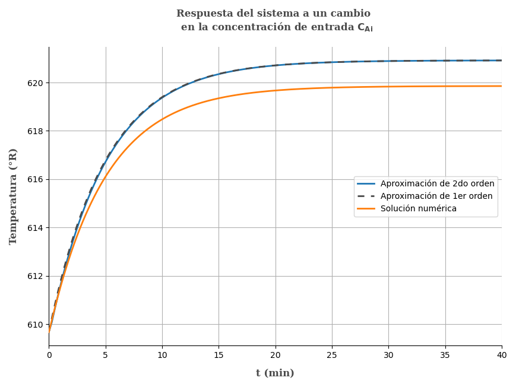

## Problema 5.21 (Process Dynamics and Control - Seborg, Edgar, M, D)

Una reacción exotérmica toma lugar en un tanque agitado adiabático, La reacción líquida ocurre a volumen constante V = 100 gal, La reacción puede ser considerada de primer orden e irreversible dada por la ecuación 
$$
k = k_0e^{-E_R/T}
$$
Con $k_0=2.4\times 10^{15}$ y $E_R = 20\space000$.
Donde T esta en °R, usando los datos proporcionados abajo determine la función transferencia que relaciona la temperatura de salida T, y la concentración de entrada CAi, describa lo que se asume para resolverlo. Simplifique la función transferencia haciendo una aproximación a primer orden, muestre que es válida con una perturbación tipo escalón unitario(heaviside) y compare las respuestas con la respuesta original y la respuesta de función de transferencia no simplificada.

Condiciones de estado estacionario

$$
\begin{array}{ll}
T_s = 150 \space °F & C_{Ais}=0.8\space lb\space mol/pie^3\\
q=20\space gal/min & \\
\end{array}
$$

Propiedades físicas de la mezcla

$$
\begin{array}{ll}
C_p=0.8\text{ BTU/(lb °F)}& \rho=52\text{ lb/pie³}\\
-\Delta H_R = 500\text{ kJ/(lb mol)}\\
\end{array}
$$

Reescribiendo nuestros datos, pero estandarizando unidades. Sabiendo que:
$$
\begin{array}{cc}
T[°R]= T[°F]+459.67 &1\text{ pie³ } = 7.48\text{ gal}\\
1\text{ BTU } = 1.055\text{ kJ}\\
\end{array}
$$

$$
T_s = 609.67 \text{ °R}\\
-\Delta H_R = 473.9336 \text{ BTU/(lb mol)}\\
q = 2.6738 \text{ pie³/min}\\
V = 13.3690\text{ pie³}
$$

Realizando el balance de materia para los moles de A. 

$$
V\frac{dC_A}{dt}=q(C_{Ai}-C_A)-Vk(T)C_A \space\space\space\space\textbf{ .... (1)}
$$

Realizando el balance en estado estacionario

$$
0=q(C_{Ais}-C_{As})-Vk(T_s)C_{As}\space\space\space\space\textbf{ .... (2)}
$$

Restado (1) y (2) y adecuando la ecuación para cambiar a variables desviación

  $$
  V\frac{d(C_A-C_{As})}{dt}=q\left[(C_{Ai}-C_{Ais})-(C_A-C_{As})\right]-V\left[k(T)C_A-k(T_s)C_{As}\right]
  $$

Conviertiendo a variables desviación

  $$
  V\frac{dC'_A}{dt}=q(C'_{Ai}-C'_A)-V(k(T)C_A-k(T_s)C_{As}) \space\space\space\space\textbf{...(3)}
  $$

Linealizando la expresión $k = k_0e^{E_R/T}$ usando la aproximaciones en series de taylor al rededor del el punto del estado estacionario.

  $$
  f(x,y)=f(x_s,y_s)+\frac{df}{dx}\bigg|_{x=x_s}(x-x_s)+\frac{df}{dy}\bigg|_{y=y_s}(y-y_s)
  $$

Reemplazando con $f(T,C_A)=k(T)\cdot C_A$ con $k(T) = k_0e^{-E_R/T}$ y $T$, $C_A$ como variables independientes

  $$
  \frac{df}{dT}\bigg|_{T=T_s, C_A=C_{As}}= \frac{k_0E_R}{T_s^2}e^{-E_R/T_s}C_{As}
  $$

  $$
  \frac{df}{dC_{A}}\bigg|_{T=T_s, C_A=C_{As}}= k_0e^{-E_R/T_s}
  $$

$$
k(T)C_A = k(T_s)C_{As}+\frac{k_0E_R}{T_s^2}e^{-E_R/T_s}C_{As}(T-T_s)+ k_0e^{-E_R/T_s}(C_A-C_{As})
$$

En variables desviación es:

$$
k(T)C_A - k(T_s)C_{As}=\frac{k_0E_R}{T_s^2}e^{-E_R/T_s}C_{As}T'+ k_0e^{-E_R/T_s}C'_A\textbf{ ... (4)}
$$

Para una ecuación muy extensa es mejor reemplazar cuidadosamente los datos, pero antes debemos hallar el valor de $C_{As}$.

Despejando de la ecuación (2) del balance en estado estacionario.

$$
0=q(C_{Ais}-C_{As})-Vk(T_s)C_{As}
$$

$$
0=q(C_{Ais}-C_{As})-Vk_0e^{E_R/T_s}C_{As}
$$

$$
0=2.6738(0.8-C_{As})-13.3690\times 2.4\times 10^{15} e^{-20000/609.67}C_{As}
$$

Despejando

$$
C_{As}=0.0116\text{ lb mol/ pie³}
$$

Ahora reemplazando todos los datos conocidos en la ecuación (4)

$$
\begin{array}{l}
k(T)C_A - k(T_s)C_{As} = \\ \\ \frac{2.4\times 10^{15} 20000}{609.67^2}e^{-20000/609.67}\times 0.00116T'+ 2.4\times 10 ^{15}e^{-20000/609.67}C'_A
\end{array}
$$

$$
k(T)C_A - k(T_s)C_{As} = 0.008485T'+12.2025C'_A \space\space\textbf{ ... (5)}
$$

Reemplazando en la ecuación (3) y reemplazando datos conocidos

  $$
  V\frac{dC'_A}{dt}=q(C'_{Ai}-C'_A)-V(k(T)C_A-k(T_s)C_{As})
  $$

  $$
  V\frac{dC'_A}{dt}=q(C'_{Ai}-C'_A)-V(0.008485T'+12.2025C'_A)
  $$

  

  $$
  13.369\frac{dC'_A}{dt}=2.6738(C'_{Ai}-C'_A)-13.369(0.008485T'+12.2025C'_A)
  $$

  
  $$
  13.3690\frac{dC'_{A}}{dt}=2.6738(C'_{Ai}-C'_A)-0.11343 T'-163.1352C'_A
  $$

Aplicando la transformada de Laplace y ordenando

  $$
  13.369sC'_A(s)=2.6738C'_{Ai}(s)-0.11343T'(s)-165.809C'_A(s)
  $$

  $$
  C'_A(s) = \frac{2.6738C'_{Ai}(s)-0.11343T'(s)}{13.369s+165.809}\space\space\textbf{ ... (6)}
  $$

Realizando el balance de energía del sistema

$$
\left(\frac{dU}{dt}\right)=H_i-H+\Delta H_R(T)
$$

$$
\rho V C_p \frac{dT}{dt}=q\rho C_p(T_i-T)+V\Delta H_Rk(T)C_A
$$

En estado estacionario

$$
0=q\rho C_p(T_{is}-T_s)+V\Delta H_Rk(T_s)C_{As}
$$

Restando ambas ecuaciones y expresando en variables desviación

  $$
  \rho V C_p \frac{dT'}{dt}=q\rho C_p(T'_i-T')+V\Delta H_R(k(T)C_A - k(T_s)C_{As})
  $$

Reemplazando la ecuación (5) y reemplazando valores conocidos

$$
\begin{array}{l}
52 \times 13.369 \times 0.8 \frac{dT'}{dt}=\\ \\
2.6738\times 52\times 0.8(T'_i-T')+13.369\times 473.9636(0.008485T'+12.2025C'_A)
\end{array}
$$

$$
556.1504\frac{dT'}{dt}=111.2300(T'_i-T')+53.7645T'+77315.2633C'_A
$$

Observando la ecuación y revisando el enunciado no pide hallar la función transferencia que relaciona la temperatura con la concentración de entrada es decir $T'(s)/C'_{Ai}$, 

y no indica una variación en la temperatura de entrada $T_i$ al no existir variación en la temperatura $T_i$ 

la variable desviación es 

$$
T'_i = T_i-T_{is} = T_{is}-T_{is}=0
$$

.

Por lo que nuestra ecuación anterior se simplifica a:

$$
556.1504\frac{dT'}{dt}=-57.4655T'+77315.2633C'_A
$$

Aplicando la transformada de Laplace y ordenando

$$
556.1504sT'(s)=-57.4655T'(s)+77315.2633C'_A(s)
$$

$$
T'(s)(556.1504s+-57.4655)=77315.2633C'_A(s)
$$

Reemplazando $C'_A$ de la ecuación (6)

$$
T'(s)(556.1504s+57.4655)=77315.2633\left(\frac{2.6738C'_{Ai}(s)-0.1134T'(s)}{13.369s+165.809}\right)
$$

$$
T'(s)(556.1504s+57.4655)(13.369s+165.809)+8767.5508T'(s)=77315.2633\times 2.6738C'_{Ai}(s)
$$

$$
\frac{T'(s)}{C'_{Ai}(s)}=\frac{206725.5510}{(556.1504s+57.4655)(13.369s+165.809)+8767.5508}
$$

$$
\frac{T'(s)}{C'_{Ai}(s)}=\frac{206725.5510}{7435.1747s^2+92982.998s+18295.8479}
$$

$$
\frac{T'(s)}{C'_{Ai}(s)}=\frac{27.8037}{s^2+12.5058s+2.4607}
$$

$$
\frac{T'(s)}{C'_{Ai}(s)}=\frac{27.8037}{(s+0.19995)(s+12.3585)}
$$

$$
\mathbf{\frac{T'(s)}{C'_{Ai}(s)}=\frac{11.2488}{(5s+1)(0.08092s+1)}}\space\space\space\space\textbf{... }\mathbf{\alpha}
$$

Para una perturbación $C'_{Ai}=1/s$

$$
T'(s)=\frac{11.2488}{s(5s+1)(0.08092s+1)}
$$

Realizando al antitransformada(de tablas)

$$
T'(t)=11.2488\left(1-\frac{5}{4.91908}e^{-t/5}+\frac{0.08092}{4.91908}e^{-t/0.08092}\right)\space\space\space\space\textbf{... }\mathbf{\beta}
$$

Ahora modificando la ecuación notando que el termino 5s>>0.08092s aproximando este último a cero

$$
T'(s)=\frac{11.2488}{s(5s+1)}
$$

Realizando la antitransformada

$$
T'(t)=11.2488\left(1-e^{-t/5}\right)\space\space\space\space\textbf{... }\mathbf{\gamma}
$$

Comparando las gráficas de las ecuaciones $\mathbf{\beta}$ y $\space\mathbf{\gamma}$

Como se observa en la gráfica una aproximación de primer orden es suficiente, notesé también que existen una sobreestimación de la ganancia con la aproximación que se ha realizado.

## Referencias

* Seborg, D. E.; Edgar, T. F.; Mellichamp, D. A.; Doyle, F. J. (2016). _Process Dynamics and Control_ (4th edition). John Wiley & Sons, Inc. ISBN 978-1-119-28591-5.
