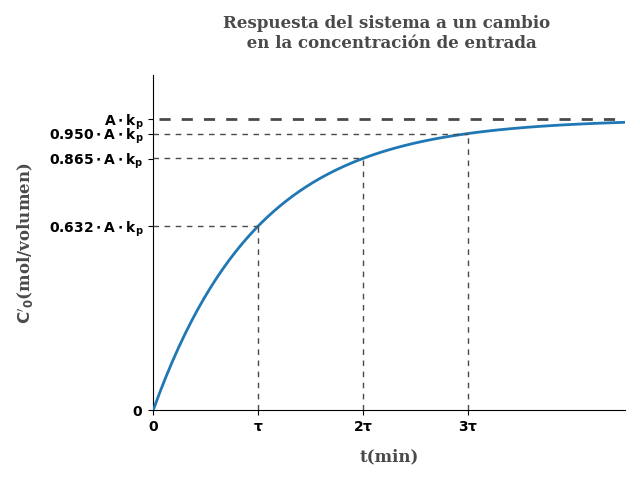

## Problema 5.5 (Process Systems Analysis and Control - Coughanowr, LeBlanc)

Considere el tanque agitado mostrado en la figura. La reacción que ocurrre es:

$$
A \to B\\
$$

Con una velocidad de reacción igual a:

$$
r=kC_0
$$

Donde

$$
\begin{array}{l}
r \text{ = (mol A)/(volumen)/(tiempo)}\\
k \text{ = constante de velocidad de reacción}\\
C_0(t)\text{ = concentración de A en el reactor en el tiempo t } (mol\space A)/(volumen)\\
V\text{ = volumen de la mezcla en el reactor}\\
F\text{ = caudal de alimentación constante (volumen)/(tiempo)}\\
C_i(t)\text{concentración de A en la entrada (mol A)/(volumen)}
\end{array}
$$

Asumiendo densidad y volumen constante V, derive la función de tranferencia, relacionando la concentración en el reactor y la concentración de entrada. Dibuje la respuesta del reactor para un cambio tipo paso unitario en la concentración de entrada.

### Resolviendo

Escribiendo nuestro balance de materia, sabiendo que $n_o = C_0V$

$$
C_iF-C_0F-kC_0V=\frac{dn_o}{dt} = \frac{d(C_0V)}{dt}
$$

$$
C_iF-C_0F-kC_0V=V \frac{d(C_0)}{dt} \space\space\space\space\space\textbf{(1)}
$$

Realizando el balance en estado estacionario

$$
C_{is}F-C_{0s}F-kC_{0s}V=0 \space\space\space\space\space\textbf{(2)}
$$

Restado (2) de (1) y tranformando a variables desviación

$$
C_iF-C_{is}F-(C_0F-C_{0s}F)-k(C_0V-C_{0s}V)=V \frac{d(C_0-C_{0s})}{dt}
$$

$$
C'_iF-C'_0F-kC'_0V=V \frac{d(C'_0)}{dt} 
$$

Aplicando la transformada de Laplace y despejando y sabiendo que $C'_0(t=0) = 0$

$$
C'_i(s)F-C'_0(s)F-kC'_0(s)V=V (sC'_0(s)-C'_0(t=0))
$$

$$
C'_i(s)F-C'_0(s)F-kC'_0(s)V=V sC'_0(s)
$$

Obteniendo nuestra función transferencia

$$
\mathbf{\frac{C'_0(s)}{C'_i(s)}=\frac{F}{Vs+F+kV}}
$$

Para poder hacer la gráfica con la variación de la concentración de entrada, reordenemos nuestra función.

$$
\frac{C'_0(s)}{C'_i(s)}=\frac{F/(F+kV)}{Vs/(F+kV)+1}
$$

Haciendo un cambio de variable

$$
K_p = F/(F+kV)\\
\tau = V/(F+kV)\\
$$

$$
\frac{C'_0(s)}{C'_i(s)}=\frac{K_p}{\tau s+1}
$$

Para un cambio en la concentración de entrada tipo paso unitario Con A como una constante cualquiera $C'_i=A/s$.

$$
C'_0(s)=\frac{A}{s}\frac{K_p}{\tau s+1}
$$

Reordenando para realizar la antitransformada

$$
C'_0(s)=\frac{A\cdot K_p+A\cdot K_p \cdot\tau s-A\cdot K_p \cdot\tau s}{s(\tau s+1)}
$$

$$
C'_0(s)=\frac{A\cdot K_p}{s}-\frac{A\cdot K_p \cdot\tau}{\tau s+1}
$$

$$
C'_0(s)=\frac{A\cdot K_p}{s}-\frac{A\cdot K_p}{s+1/\tau}
$$

Antitransformando

$$
C'_0(t) = A\cdot K_p(1-e^{-t/\tau})
$$

Graficando esta respuesta

## Referencias

* Coughanowr, D. R.; LeBlanc, S. E. (2009). _Process Systems Analysis and Control_ (3rd edition). McGraw-Hill. ISBN 978-0-07-339789-4.