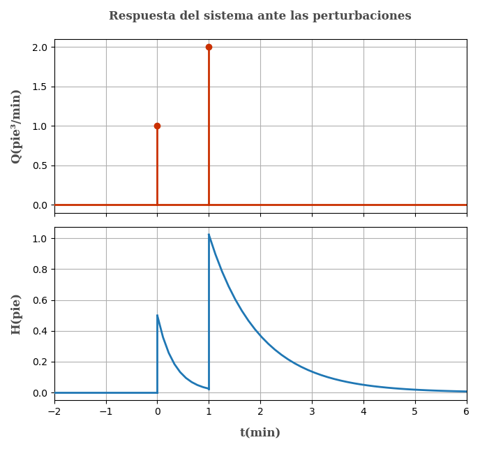
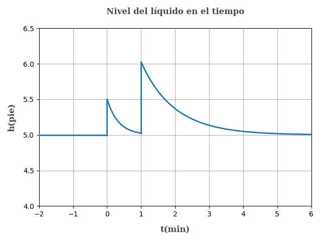

## Problema P5.9 (Process Control - Coughanowr)

El nivel del líquido del proceso mostrado en la figura opera en estado estacionario, entonces una perturbación ocurre. A t = 0,la cantidad de 1 pie³ de agua es añadida al tanque de manera repentina (impulso unitario); a t = 1min, son añadidos 2 pie³ de agua de manera repentina también. Dibuje al respuesta del nivel en el tanque (h) vs el tiempo (t), y determine el nivel en los tiempos t = 0.5, 1.0 y 1.5 minutos.
$$
\begin{array}{l}
Datos\\
\tau = 1\text{ min}\\
R = 0.5\\
q_s = 10\space pie³/min
\end{array}
$$

### Obtención de la ecuación en transferencia

Sea $q$ el caudal, $h$ el nivel del líquido

Escribiendo las ecuaciones de balance volumétrico
$$
q - q_0 = \frac{dV}{dt}
$$

Pero $q_0 = h/R$ y  $dV = Adh$

$$
q- \frac{h}{R} = A\frac{dh}{dt} \space\space\space\space (1)
$$

Escribiendo el balance en estado estacionario

$$
q_s- \frac{h_s}{R} = 0 \space\space\space\space (2)
$$

Restando (1) con (2) para obtener las variables desviación y recordando que $dh=d(h-h_s)$, por ser $h_s$ constante.

$$
q-q_s-\frac{h-h_s}{R}=A\frac{d(h-h_s)}{dt}
$$

$$
Q - \frac{H}{R} = A\frac{dH}{dt}
$$

Aplicando la tranformada de Laplacey sabiendo que $H(t=0)= h-h_s=h_s-h_s=0$

$$
Q(s) - \frac{H(s)}{R} = A\left[sH(s)-H(t=0)\right]\\
\\
Q(s) - \frac{H(s)}{R} = AsH(s)
$$

Despejando y sabiendo que $\tau=AR$

$$
\frac{H(s)}{Q(s)}=\frac{R}{ARs+1} 
$$

$$
\frac{H(s)}{Q(s)}=\frac{R}{\tau s+1} 
$$

Reemplazando los valores $\tau = 1$ y $R=0.5$

$$
\frac{H(s)}{Q(s)}=\frac{0.5}{s+1} \space\space\space\space (3)\\
$$

### Descripción de la perturbación

La perturbación sólo va a afectar el caudal de ingreso, esta puede ser representado por la variable desviación $Q(t)$. Para diferenciar el impulso unitario se pondrá el simbolo de $\infty$ al lado del valor de la perturbación.

$$
Q(t)=
\begin{cases}
   0 &\text{si } t < 0 \\
   1 \space\ pie³/min\space \space\space(\infty) &\text{si } t=0\\
   0 \space\  &\text{si } t>0\\
   2 \space\ pie³/min\space\space\space (\infty) &\text{si } t=1 min\\
\end{cases}
$$

Expresando la misma función con impulsos unitarios y aplicando la transformada de Laplace

$$
\begin{array}{l}
Q(t) = 1 \cdot \delta (t) + 2 \cdot \delta (t-1) \space\space\space\space //L\ (\ ) \\
Q(s) = 1 + 2\cdot e^{-s}\cdot L\{ \delta (t) \}\\
Q(s) = 1 + 2 \cdot e^{-s}
\end{array}
$$

Reemplazando la expresión anterior en la ecuación (3)

$$
\begin{array}{l}
H(s)= Q(s)\cdot \frac{0.5}{s+1} \\
\\
H(s) = \left(1+2e^{-s}\right)\frac{0.5}{s+1}\\
\end{array}
$$

Despejando y aplicando la antitransformada $L^{-1}\{\space\}$
Recuerde que la expresión $e^{-as}$ crea un desfase de tiempo en la antitranformada igual a $t-a$, también $L^{-1}\{\frac{1}{s+k}\}= e^{-kt}$

$$
H(s) = \frac{0.5}{s+1}+\frac{e^{-s}}{s+1}\\
$$

$$
\begin{array}{l}
H(t) = 0.5\cdot e^{-t} \cdot u(t)+ e^{-t}\cdot u(t) |_{t=t-1}\\
\\
H(t) = 0.5\cdot e^{-t}\cdot u(t) + e^{-(t-1)} \cdot u(t-1)
\end{array}
$$

_Notese que normalmente se omite el término $u(t)$ en la antitransformada, pero en este caso es necesario ponerlo para aclarar los dominios_

Escribiendo nuestra ecuación de manera más entendible

$$
H(t)=
\begin{cases}
   0.5\cdot e^{-t} &\text{si }\space 0 < t < 1\\
   0.5\cdot e^{-t} + e^{-(t-1)} &\text{si } \space t>1\\
\end{cases} \space\space\space\space\space \textbf {(4)}
$$

Con las funciones ya determinadas podemos graficarlas.

Del enunciado nos piden calcular las el valor de $h(t=0.5)$, $h(t=1)$ y $h(t=1.5)$

Recuerde que $H = h-h_s$ por que lo que $h=H+h_s$

Determinado $h_s$ de la ecuación del estado estacionario

$$
q_s- \frac{h_s}{R} = 0\\
\\
h_s = q_s \cdot R = 10\cdot 0.5 = 5 pie
$$

Usando la ecuación (4) para hallar lo solicitado

$$
\begin{array}{l}
h(t=0.5) = H(t=0.5)+5\\
\\
\mathbf{h(t=0.5) = 0.5\cdot e^{-0.5} + 5 = 5.3033\text{ pie}}
\end{array}
$$

Para cuando t = 1 min nuestra función matemática no esta definida (los puntos en la gŕafica son punteagudos y hay una pendiente infinita) pero si la tenemos definida antes y despues de la perturbación, teniendo eso en cuenta y sabiendo que nuestro modelo es una aproximación del fenómeno, indicamos que la altura inmediatamente antes de la perturbación a t = 1 min es:

$$
h(t=1)= 0.5\cdot e^{-1} + 5\\
$$

$$
\mathbf{h(t=1)=5.1839\text{ pie}}
$$

E inmediatamente después de la perturbación a 1 minuto

$$
h(t=1)= 0.5\cdot e^{-(1-1)}+e^{-1} + 5\\
$$

$$
\mathbf{h(t=1) = 6.1839\text{ pie}}
$$

A t = 1.5 min

$$
h(t=1.5)= 0.5\cdot e^{-1.5} + e^{-(1.5-1)} + 5\\
$$

$$
\mathbf{h(t=1.5)= 5.7181\text{ pie}}\\
$$

Para completar el ejercicio, grafiquemos el nivel del líquido en el tiempo (h vs t)

La grafíca es similar a la gráfica de H(t) vs t, con la diferencia de que esta desplazado en el eje de las ordenadas.

## Referencias

* Coughanowr, D. R.; LeBlanc, S. E. (2009). _Process Systems Analysis and Control_ (3rd edition). McGraw-Hill. ISBN 978-0-07-339789-4.
