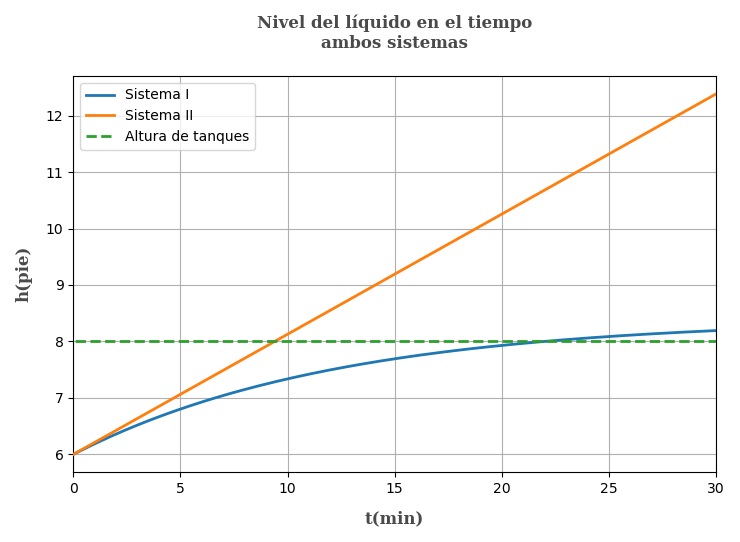

## Problema 5.9 (Process Dynamics and Control - Seborg, Edgar, M, D)

Dos tanques mostrados en la figura, cada uno tiene un diámetro de 4 pie, Para el primer sistemas la válvula tiene una resistencia linear con la ecuación $q = 8.33\  h$ con q en (gal/min) y h en (pie). Para el segundo sistema, la variación en el nivel del líquido no afecta el caudal de salida $q$ . Suponga que cada sistema esta inicialmente en estado estacionario con $h_s = 6\ pie$ y $q_s = 50\ gal/min$. A $t=0$ el caudal de entrada se incrementa de 50 a 70 gal/min.

Determine para cada sistema

a) La función transferencia $H(s)/Q(s)$

b) La función h(t)

c) Los nuevos estados estacionario

d) Si cada tanque tiene 8 pie de altura, ¿cuál tanque rebalsa primero y cuando?

e) Verifique los resultado en d) graficando lo resultados

### Datos

$$
\begin{array}{rl}
d = &4 pie\\
h_s= &6 pie\\
q_{is}=&50\ gal/min\\
q_i=&70\ gal/min\\
h_s=&8\ pie\\
q=&8.33\ h\ gal/min
\end{array}
$$

Estandarizamos los datos anteriores (es decir convertimos a unidades compatibles) y obtenemos el área de los tanques.
(7.48 gal = 1 pie³)
$$
\begin{array}{l}
A\ = \frac{\pi d^2}{4}\ =\ 12.5665\ pie^2\\
\\
q_{is}\ =50/7.48\ =\ 6.6845\ pie^3/min\\
\\
q_i\ =\ 9.3583\ pie^3/min\\
\\
q\ =\ 8.33\frac{gal}{min\cdot pie}\ h \frac{1\ pie^3}{7.48\ gal} = 1.1136\ h\\
\end{array}
$$

Para simplificar las operaciones hagamos $q=kh$ con $k=1.1136$

### Derivación de la ecuación tranferencia para el primer tanque

Escribiendo las ecuaciones de balance de materia (asumiendo densidad constante) en estado transitorio y en estado estacionario:

$$
A\frac{dh}{dt}= q_i-kh
$$

$$
0=q_{is}-kh_s
$$

Restando ambas ecuaciones y pasando a variables desviación

$$
A\frac{dH}{dt}=Q_i-kH
$$

Aplicando la transformada de Laplace

$$
AsH(s)=Q_i(s)-kH(s)
$$

$$
\frac{H(s)}{Q(s)}=\frac{1/K}{As/K+1}
$$

Reemplazando valores conocidos

$$
\mathbf{\frac{H(s)}{Q(s)}=\frac{0.8980}{12.2845s+1}}\space\space\space\space\textbf{... (1)}
$$

### Obteniendo la función transferencia para el segundo sistema

Planteando los balances en estado transitorio y estacionario con $q_b$ para el caudal de la bomba

$$
A\frac{dh}{dt}=q_i-q_b
$$

$$
0=q_{is}-q_b
$$

Restando ambas ecuaciones y conviertiendo a variables desviación

$$
A\frac{d(h-h_s)}{dt}=q_i-q_{is}
$$
$$
A\frac{dH}{dt}=Q_i
$$

Aplicando la transformada de Laplace y despejando la función tranferencia

$$
AsH(s)=Q_i(s)
$$

$$
\frac{H(s)}{Q_i(s)}=\frac{1}{As}
$$

Reemplazando datos conocidos

$$
\mathbf{\frac{H(s)}{Q_i(s)}=\frac{1}{12.5664s}} \space\space\space\space\textbf{... (2)}
$$

### Respuesta de los sistema a la perturbación

Decripción de la perturbación

$$
Q(t)= q(t)-q_s
\begin{cases}
   q_s-q_s&\text{si } t < 0 \\
   q_i-q_s &\text{si } t > 0\\
\end{cases}
$$

$$
Q(t)= q(t)-6.6845
\begin{cases}
   0&\text{si } t < 0 \\
   9.3583-6.6845=2.6738 &\text{si } t > 0\\
\end{cases}
$$

$$
\begin{array}{lcr}
Q(t)=2.6738u(t)&\rightarrow & Q(s)=\frac{2.6738}{s}\\
\end{array}
$$

$$
\mathbf{Q(s)=\frac{2.6738}{s}}
$$

Reemplazando en la ecuación (1) $Q(s)=\frac{2.6738}{s}$

$$
H(s)=\frac{2.6738\times 0.8980}{s(12.2845s+1)}
$$

Separando en fracciones parciales y aplicando la antitransformada (Puede reemplazar de tablas directamente)

$$
H(s)=2.4011\left(\frac{1}{s}-\frac{1}{s+1/12.2845}\right)
$$

$$
H(t)=2.4011(1-e^{-t/12.2845})
$$

Recordando que $H(t)=h(t)-h_s$ con $h_s=6\ pie$

$$
h(t)=2.4011(1-e^{-t/12.2845})+6
$$

Calculanado para que tiempo se llegará a una altura de h=8

$$
8=2.4011(1-e^{-t/12.2845})+6
$$

$$
t=-12.2845ln\left(1-\frac{2}{2.4011}\right)
$$

$$
\mathbf{t_I=21.98\ min}
$$

Calculando el nuevo estado estacionario para el primer sistema

$$
h(t\to\infty)=\lim_{t\to\infty}2.4011(1-e^{-t/12.2845})+6 
$$

$$
\mathbf{h_{sI}= 8.4011\ pie}
$$

Para el sistema 2 reemplazando (2)  $Q(s)=\frac{2.6738}{s}$

$$
H(s)=\frac{2.6738}{s(12.5664s)}
$$

Realizando la antitranformada y despejando para $h(t)$

$$
H(t)=0.2128\cdot t
$$

$$
h(t)=0.2128t+6
$$

El tiempo para el cual $h = 8$

$$
8=0.2128t+6
$$

$$
\mathbf{t_{II}=9.40\ min}
$$

Calculando el nuevo estado estacionario para el sistema II

$$
h(t\to\infty)=\lim_{t\to\inf}0.2128t+6
$$

$$
\mathbf{h_{sII}=\infty}
$$

Es decir el sistema 2 no tiene un nuevo estado estacionario y tiende al infinito.

Siendo que $t_{II}<t_I$ determinamos que el **sistema II rebalsa primero**

Graficando ambos sistemas

## Referencias

* Seborg, D. E.; Edgar, T. F.; Mellichamp, D. A.; Doyle, F. J. (2016). _Process Dynamics and Control_ (4th edition). John Wiley & Sons, Inc. ISBN 978-1-119-28591-5.
